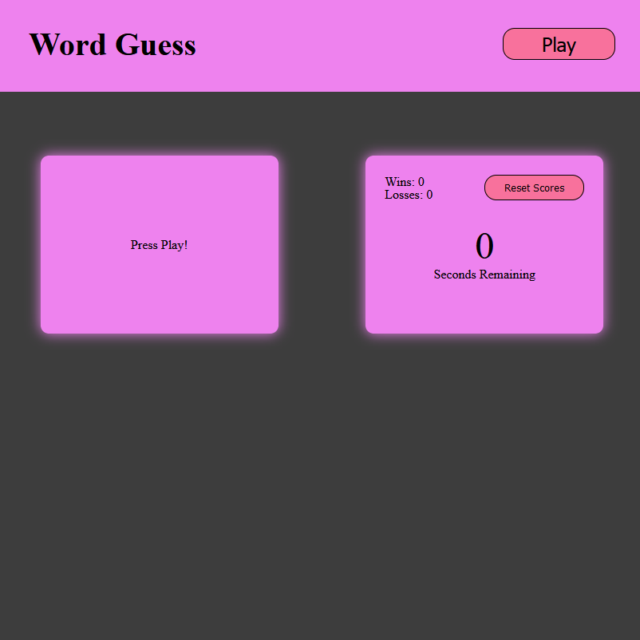

# Word Guess Game

## Description

This is a word guessing game similar to the popular "Hangman". The difference here is that the only loss condition is the timer running out. Make as many wrong guesses as you want and have fun!

I build this assignment to strengthen my knowledge about functions and JavaScript events.
I learned about the use of multiple simple functions to perform a larger task. I also learned about timers and the asyncronous aspect of them.

## Table of Contents (Optional)

## Installation

N/A

## Usage

This game is played by pressing the "Play" button and beginning to type letters on your keyboard. If you guess a letter that is correct, it'll be filled in. When you've guessed all of the letters, you'll be greeted with a small victory message. If you can't figure out the word in the allotted time, you'll be met with a loss message. Your scores will be located on the right and will persist even after you leave the application. Pressing the "Reset Scores" button will remove your saved scores and revert them to 0.Provide instructions and examples for use. Include screenshots as needed.

## Tests

Go the extra mile and write tests for your application. Then provide examples on how to run them here.
